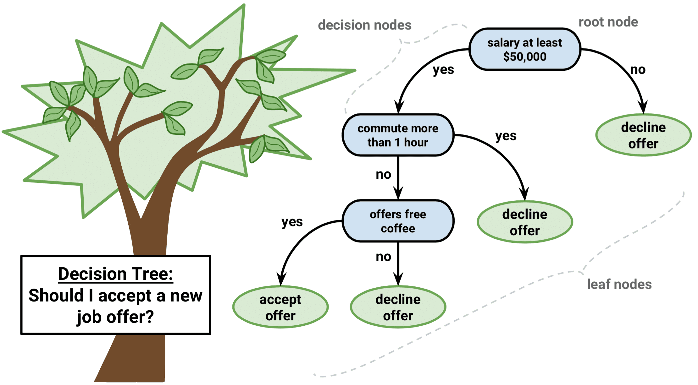
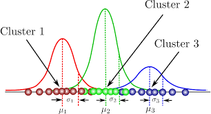
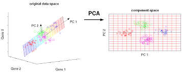
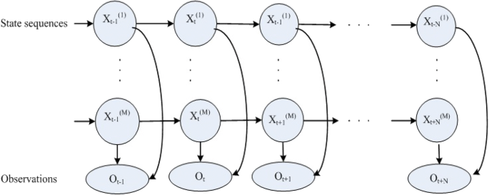

# INF 552 - Machine Learning for Data Science - USC
Homework solutions for INF552 (Data Mining) at University of Southern California

## HW1: Decision Tree

## HW2: K-means - GMM

## HW3: PCA-Fastmap

## HW4: Perceptron - Linear Regression - Logistic Regression

## HW5: Neural network

## HW6: SVM

## HW7: HMM

